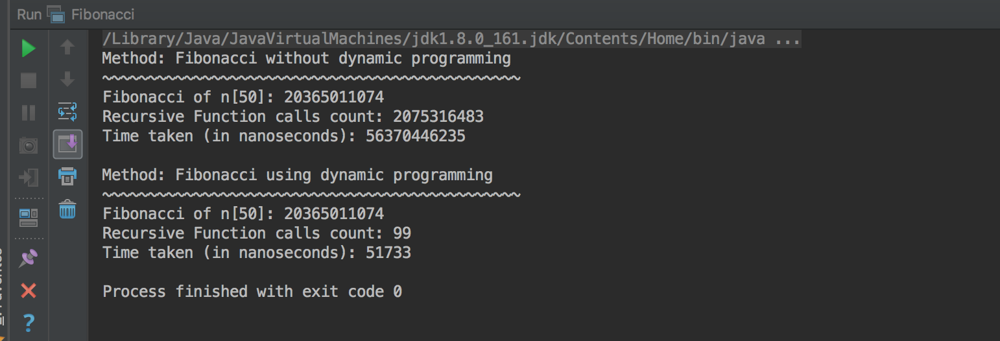

# Dynamic Programming
Algorithms | Fibonacci Implementation using Memoization (Dynamic Programming)  

## Notes
Dynamic Programming - Algorithmic paradigm that solves a given complex problem by breaking it into subproblems and stores the results of subproblems to avoid computing the same results again

